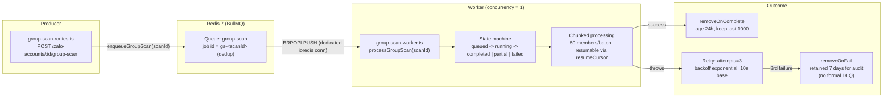

# Queue Flow Diagrams & Architecture

> Generated by `nqdev-codebase-analyst` (Phase 4.5) on 2026-08-21. Grounded in direct code inspection of `backend/src/modules/zalo/`, `backend/src/modules/tags/`, `backend/src/shared/queue/`, and `docker-compose.yml`.

## Overview

ZCRM's async infrastructure runs on **Redis 7 + BullMQ**, declared a hard (non-optional) dependency in `docker-compose.yml` — the `redis` service has no `profiles:` gate (a comment in the compose file notes this was deliberately removed once BullMQ became a hard dependency). Despite that, in this **Community-edition checkout, only one BullMQ queue is actually wired and running**: `group-scan`. A second queue is fully coded but explicitly deferred, and the marketing-facing "Friend Invite Queue" referenced in `docker-compose.yml`'s `FRIEND_INVITE_TEST_MODE` env var has no implementation in this checkout at all — it lives in the absent commercial `_ee/automation` bundle. Alongside BullMQ, roughly 14 `node-cron`/interval-based scheduled jobs handle the bulk of the system's background work.

## System Architecture Overview

See [diagrams/architecture-diagram.mermaid](diagrams/architecture-diagram.mermaid) for the full system view, and [diagrams/queue-flow-diagram.mermaid](diagrams/queue-flow-diagram.mermaid) for the queue-specific flow reproduced below.

## Detected Queue Systems

### 1. `group-scan` — Zalo Group Membership Scan Queue

- **Type**: Single-worker sequential job queue (deliberately not parallelized).
- **Technology**: BullMQ on Redis 7, self-contained connection — `backend/src/modules/zalo/group-scan-queue.ts` builds its own inline `ioredis` connection rather than using the shared helper (`backend/src/shared/queue/redis-connection.ts`), with an explicit comment that this is intentional so the Community queue has zero import surface into the `_ee` tree (`scripts/check-no-ee-leak.sh` fails CI-equivalent checks on any `_ee` import from core).
- **Topology**: producer → queue `group-scan` → single worker, concurrency **1**.
- **Workers**: 1 process, concurrency 1 — explicit design choice: "1 nick quét tuần tự... chạy song song = burst → Zalo anti-spam" (sequential per-nick scanning; parallel scanning would trigger Zalo's anti-spam detection).
- **Job identity**: `gs-${scanId}` — deterministic, so re-enqueuing the same scan is a no-op dedup rather than a duplicate job.

#### Configuration Details

| Setting | Value | Source |
|---|---|---|
| Concurrency | 1 | `group-scan-worker.ts` (explicit anti-spam design) |
| Retry attempts | 3 | `group-scan-queue.ts` job options |
| Backoff strategy | Exponential, 10s base delay | `group-scan-queue.ts` |
| Chunk size | 50 members/batch | `group-scan-worker.ts` |
| Resumability | Yes, via `resumeCursor` | `group-scan-worker.ts` state |
| `removeOnComplete` | age 86400s (24h), keep last 1000 | `group-scan-queue.ts` |
| `removeOnFail` | age 604800s (7 days) | `group-scan-queue.ts` — retained for manual audit, **no separate DLQ** |
| Connection | Dedicated `ioredis`, separate producer/worker connections | Comment: blocking `BRPOPLPUSH` shouldn't share a socket with `queue.add()` |
| Lifecycle | Started conditionally (`if config.nodeEnv !== 'test'`), stopped on SIGTERM/SIGINT | `app.ts` |

#### Message Flow

1. Org admin/manager triggers a group scan from the frontend (`views/GroupScanView.vue`) → `POST /zalo-accounts/:id/group-scan`.
2. Route handler creates a `GroupScan` DB row (`status: queued`) and calls `enqueueGroupScan(scanId)`.
3. BullMQ enqueues job id `gs-<scanId>` on the `group-scan` queue.
4. The single worker (concurrency 1, own process loop) picks up the job, transitions state `queued → running`.
5. `processGroupScan(scanId)` fetches group members in **50-member chunks**, persisting `GroupMember` rows and advancing `resumeCursor` after each chunk — if the process crashes mid-scan, the next attempt resumes from the cursor instead of restarting.
6. On success: state → `completed` (or `partial` if some members failed to enrich), job retained 24h for observability then auto-removed.
7. On throw: BullMQ retries up to 3 times with exponential backoff (10s, 20s, 40s); after the 3rd failure the job moves to the failed set and is retained 7 days for manual inspection — there is no automatic dead-letter routing or alerting on repeated failure.

#### Performance Analysis

No load-test numbers exist in the codebase (no benchmark scripts, no captured throughput metrics for this queue) — this is a genuine gap, not an oversight in this doc. The concurrency-1 design is a deliberate throughput ceiling: **only one group scan runs at a time system-wide**, which caps this feature's scalability by design (trading throughput for anti-block safety). For a multi-org deployment with many concurrent scan requests, this single-worker design is worth flagging as a scaling constraint if usage grows.

### 2. `zalo-label-mutate` — Deferred, Not Wired

- **Type**: Would-be per-account serialization queue for Zalo label mutations.
- **Technology**: BullMQ, defined in `backend/src/modules/tags/zalo-label-queue.ts`.
- **Status**: The file header literally states `STATUS: DEFER 2026-06-01 — CODE GIỮ DẰN DÀNH, CHƯA WIRE VÀO ROUTE` ("code kept on standby, not wired into any route"). **Zero callers** of `enqueueZaloLabelMutate` or `startZaloLabelWorker` exist anywhere in `src/`.
- **Intended purpose** (per code comments, not yet active): serialize concurrent Zalo label-update calls per account, because the underlying zca-js `updateLabels` SDK call replaces the entire label structure atomically — concurrent calls would race and lose data. Job dedup key would be `${zaloAccountId}:${labelId}:${threadId}`; `attempts: 3`, exponential backoff 1s.
- **Recommendation**: not a bug to fix, but flag for the team — either wire it in if the label-race condition is a live issue, or remove the dead code if the risk was mitigated another way.

### 3. "Friend Invite Queue" — Not Present in This Checkout

`docker-compose.yml` exposes a `FRIEND_INVITE_TEST_MODE` env var ("60s tick delay instead of 20-40min") implying a real queue exists somewhere. Grepping all of `backend/src/` finds **zero** references to this as an actual queue implementation — only a `Contact.friendInviteSentCount` counter column that a producer elsewhere presumably increments. Per `app.ts`'s own comments, "Automation + Marketing (engine, blocks, sequences, triggers, broadcasts, care-session, lists, friend-invite) → extension bundle (`src/_ee/automation`)" — this queue is part of the commercial Enterprise bundle, not visible in this Community checkout. **Do not assume this queue's behavior; it cannot be verified from this code.**

### Scheduled Jobs (non-queue background work)

The bulk of ZCRM's background processing is `node-cron`/interval-based rather than queue-based. Full inventory:

| Job | File | Schedule |
|---|---|---|
| Friend full-sync (sequential per nick, 200ms stagger) | `zalo/friend-sync-cron.ts` | `*/15 * * * *` |
| Zalo health check (reconnect disconnected) | `zalo/zalo-health-check.ts` | `*/5 * * * *` |
| Zalo daily session/cookie refresh | `zalo/zalo-health-check.ts` | `0 4 * * *` |
| Ghost `qr_pending` cleanup | `zalo/zalo-health-check.ts` | `0 * * * *` |
| Group-info refresh (avatar/name/count) | `zalo/group-info-sync-cron.ts` | `0 */6 * * *` |
| Status-log checkpoint (uptime reconcile) | `zalo/status-log-checkpoint-cron.ts` | `*/5 * * * *` |
| Presence bulk refresh + socket emit | `zalo/presence-service.ts` | `*/1 * * * *` |
| Contact profile enrichment | `contacts/contact-profile-sync-cron.ts` | `0 3 * * *` |
| Silent-30d contact detection | `contacts/interaction-cron.ts` | `0 19 * * *` |
| Contact lead-scoring/intelligence sweep | `contacts/contact-intelligence.ts` | `30 2 * * *` |
| Appointment "tomorrow" reminder | `contacts/appointment-reminder.ts` | `0 1 * * *` |
| Appointment overdue flip + action prompts (×2) | `contacts/appointment-reminder.ts` | `*/5 * * * *` |
| Engagement daily classification + cleanup | `engagement/engagement-cron.ts` | `30 19 * * *` |
| Media trash GC (dry-run by default) | `media/media-trash-gc-cron.ts` | `30 20 * * *` |
| Lead-score decay (jittered, avoids thundering herd) | `scoring/scoring-scheduler.ts` | hourly + up to 60s jitter |
| Stuck-lead detection | `scoring/scoring-scheduler.ts` | daily, configurable hour (default 06:00) |
| Auto-tag sweep | `scoring/scoring-scheduler.ts` | daily, `stuckHour + 1` |

## Performance & Scaling

### Current Capacity

Not benchmarked in-repo. The architectural signal is clear even without numbers: every Zalo-facing background job (friend sync, health check, group scan) is deliberately **sequential/staggered/concurrency-capped**, trading throughput for platform-ban avoidance. This is a correct design choice for the product's risk profile but means the system does not scale group-scan or friend-sync throughput by adding workers — it scales by adding more Zalo accounts (nicks) worked in parallel by the *existing* per-account-sequential machinery, not by parallelizing within one account.

### Identified Bottlenecks

- **`group-scan` concurrency 1** — system-wide, not per-org; a busy multi-org deployment queues all group scans behind each other.
- **In-memory `ZaloAccountPool`** — a single Node process holds all live Zalo sessions; no horizontal scaling path exists without a redesign (session affinity or a shared session store).
- **Redis `maxmemory 256mb`, `noeviction` policy** (`docker-compose.yml` comment: sized for "~35K jobs cumulative, 5K KH/day × 7 days") — a capacity ceiling that was explicitly sized for the group-scan queue's expected volume; if the deferred `zalo-label-mutate` queue or an EE queue set is added, this budget should be re-evaluated.

### Scaling Recommendations

1. If group-scan volume grows across many orgs, consider per-org (not just global) concurrency limits rather than a single global concurrency-1 worker.
2. Re-evaluate the Redis `maxmemory` budget before wiring in any additional queue (`zalo-label-mutate` or EE queues sharing the same Redis instance).
3. Decide the fate of `zalo-label-mutate`: wire it in or remove it — dead-but-correct code is a maintenance cost either way.
4. If the EE bundle is deployed alongside Community in the same environment, confirm its queues use the shared `redis-connection.ts` helper (as its docstring implies) rather than each opening independent connections, to avoid connection-count sprawl.

## Deployment & Operations

### Redis

- Single instance (`docker-compose.yml`), **not clustered**, AOF persistence (`appendonly yes`, `appendfsync everysec`) specifically so BullMQ's delayed/waiting jobs survive a container `kill -9` (verified via a documented proof-of-concept spike, 5/5 pass).
- `maxmemory 256mb`, `maxmemory-policy noeviction` — jobs are never silently evicted under memory pressure; a full queue would instead cause write failures, which is the safer failure mode for job data.
- Bound to `127.0.0.1` only in the host port mapping — not exposed externally.

### BullMQ

- No Bull Board or other queue-monitoring UI is wired up in this checkout (the shared `redis-connection.ts` helper's docstring mentions "Bull Board" as a future consumer, but no such route/service exists yet).
- No queue-depth or consumer-lag alerting exists — operational visibility into the `group-scan` queue is currently limited to the `GroupScan.status` DB rows and Fastify logs.

## Monitoring & Alerts

**Currently absent** — this is a gap, not a documented feature. Recommended additions if this becomes a priority:
- Queue depth alerting on `group-scan` (warn if backlog exceeds N pending scans).
- Failed-job-count alerting (the 7-day retention window is for manual inspection only; nothing currently pages anyone).
- Redis memory-usage alerting given the fixed 256MB ceiling with `noeviction`.

## Open Questions & Future Improvements

1. Should `zalo-label-mutate` be wired in, or removed as dead code? It's been in `DEFER` status since 2026-06-01.
2. Is the "Friend Invite Queue" (EE-only) intended to ever ship in Community edition, or is it a permanent Enterprise differentiator? Not answerable from this checkout.
3. No load-testing data exists for `group-scan` — worth establishing a throughput baseline if multi-org scan volume becomes a support concern.
4. Consider whether the concurrency-1 group-scan limit should become per-org rather than global, if multi-tenant scan contention becomes a real complaint.
5. No DLQ or automated retry-exhaustion alerting exists for `group-scan` — currently a human has to notice failed jobs within the 7-day retention window.
</content>
